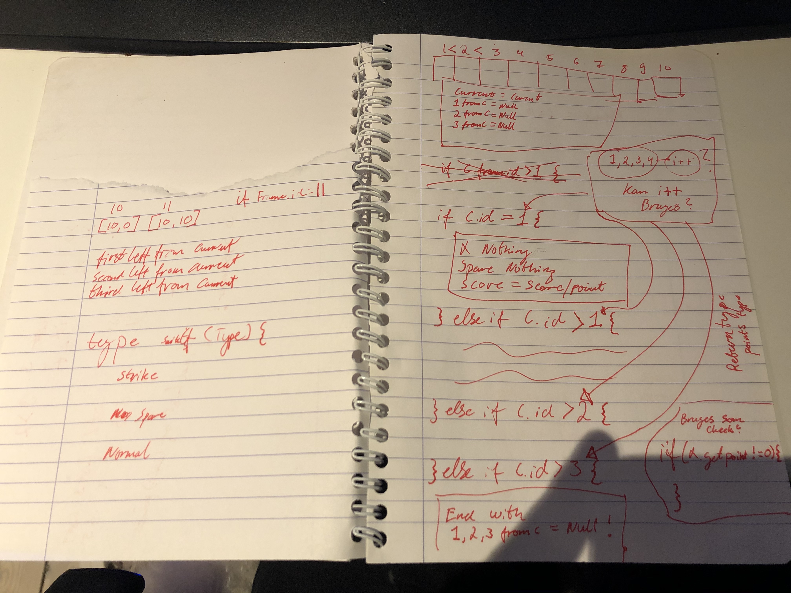
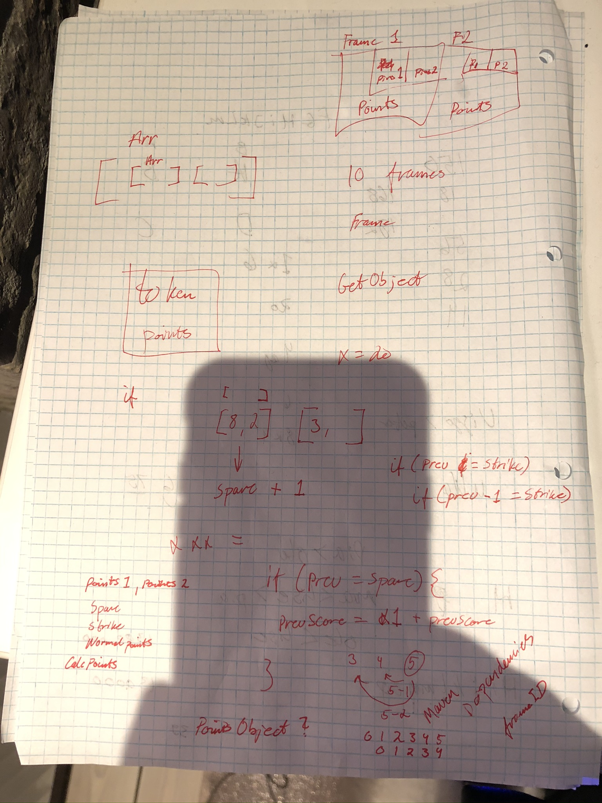
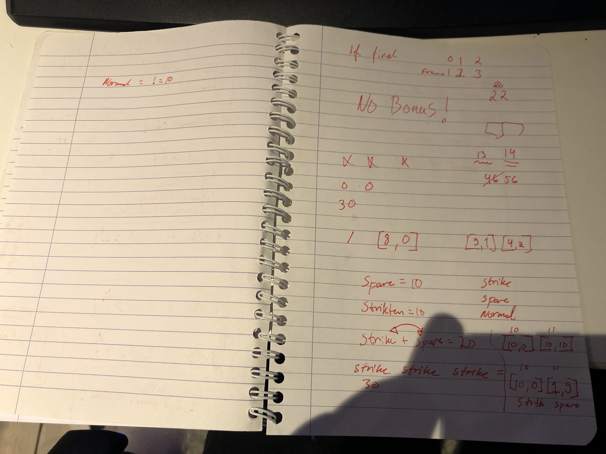

# Bowling Assignment

**Language**: *Java* 
  
**Version**: *Java 11.0.2* - *JDK 10.0.2*  

**Project Type**: *Java Maven*

**Created with IDE**: *IntelliJ 2020.1*

##
### How to run:

* Open the project folder *Bowling* using an IDE that can compile and run *Java* Applications (Ex: [Netbeans](https://netbeans.org/) or [IntelliJ](https://www.jetbrains.com/idea/download/#section=windows))
* Make sure the IDE is pointing on the ***Main***-java. 
    * Alternative, right click on the ***Main***-file (should be located *Bowling/src/main/java/com.company/main.java*) and select the "Run Main.main()"
* Run the application
* The following processes are being shown in the console when the application is run:
    * Displays the scores retrieved from the server to be calculated
    * Displays the calculated results and the token, to be send to the server for verification
    * Displays the servers response, both if the received results were correct and what results were sent 
#

## About the project

Original project Description [found here](https://github.com/skat/bowling-opgave)

The project was  part of an assignment for a job interview with [SKAT](https://skat.dk/) (the danish IRS).

The assignment tasked me to create a program and algorithm, that could retrieve a collection of scores from a bowling game from a server provided by SKAT,
 correctly calculate the scores, and finally send the calculated scores back to the SKAT servers to verify the calculations.

Furthermore, the program also needed to show "a substantial amount of Test"

I chose to tackle the assignment using Java, due to the job-description specifying SKAT was looking for a JAVA-developer, and I added
 the MAVEN framework to easier add external libraries and dependencies.
 
#### The first solution: ***Calculations***
My first crack at a solution, and the one that would be handed in before deadline, can be found in the ***Calculations***-folder.
I was by no way satisfied, proud or happy about my first attempt at the assignment, which suffered from a lot of simple mistakes and my excitement and rush to deliver a solution.

To be honest, I had not programmed in JAVA for some time, having mainly programmed in C# and JavaScript during my last project, which at the time of writing this project, was back in December of 2019.

Combining my lack of programming the past couple of months, needing to quickly get back into JAVA and the excitement of having been given a project to work on and present, was a perfect cocktail for disaster.... And it showed.

Work on the assignment proceeded right up until deadline, and despite my feelings regarding my work, I handed-in my work as it was at the time, and continued to work on it through the night, to get it to a somewhat stable state.

The handed-in version was able to get the scores from the servers, perform calculations and send the results back for verification. 
But the code was clunky, messy, hard-to-read and in general bad. The calculation was insufficient and did not cover all the possible scoring scenarios,
 and there was a clear lack of Testing.

Having handed-in my solution for review by SKAT, I was left with a feeling of huge disappointment by my performance, so much so,
 that in my email with my Github-repo link to the person at SKAT that was going to review my work, I wrote that if they wanted to cancel the interview based on my solution, I would be totally ok with that. 

My first solution can still be found in the folder ***Calculations***, though note that the program will not run the methods from that folder atm.
 
Having digested my frustration and disappointment after having sent my Github-repo link to SKAT, I decided to redo the assignment from (almost) scratch, because I had to prove to myself that I could do better. 

#### The Second solution: ***CalculationsVerTwo***
Despite only having a few days before my interview, I decided to take another crack at the assignment, learning from my mistakes from the first go-around and try to avoid letting the excitement and adrenaline take over and make me rush-code.

I decided to re-use my work on the GET- and POST-classes, since my main gripe was with the way I handled the Calculation-folder and -classes, and these two performed their function ok,
 but they both did receive a few tweaks and additions during development of this second solution.
I also decided to not delete/remove the first solution from the project, so that I could see the difference.  
The new solution, its folders and its subsequent classes and files, was named with ***VerTwo*** at the end of the [Classname], to avoid clashes with existing classes with similar names in the first solution-folder.

The first iteration of this second version of the assignment was worked on for 2 days, in between having handed-in the first version for review and my interview with SKAT. 
It was pushed to Github just 3 hours before my interview, around 04 in the morning...

Despite the second solution not being totally complete before my interview, I was a lot more satisfied and happy with it.
The solution worked better, better calculations, was more readable, better comments, better doc, had more Test, and was in general a HUGE improvement from my first solution.

Because of the timing and me not informing about a new updated version of the solution on Github before my talk with SKAT, my interview was based on my first solution, which I had previously stated I was fine with. 
At the beginning of my interview and before we went through SKAT's feedback of my solution, I did inform them that I had created and pushed a new version to Github, which they could look through if they wanted to later.

#### Continued development
Despite my interview and review being based on the first solution that I provided, which I had no issues with, I enjoyed working with the assignment, 
since it provided me with a great project to get my programming back into gear. I therefore continued to work on my second solution, to use it as a project in which I could improve my problem solving and general programming capabilities,
and show my programming-style for future opportunities. 

This second solution has greatly improved since the version that I managed to create in under 2 days and pushed to Github, just 3 hours before the interview, and is vastly better in all areas than the first solution.

The current iteration of my solution can be found in the ***CalculationsVerTwo***-folder. When running the application, this is also the solution that is being run and executed.
#### What is missing / Work left to be done

The following is a list of features and work that I still need to complete in this project, and a few general thoughts/notes about the project :

* Because this was a one-person project, I did not use Branches during development, 
which in retrospective would have been preferred, since it would have made it easier to go back
 and more elegantly look at various snapshots/stages of the project during development.
* Apply and enforce the SOLID principles to the entire project
* Refactoring of variable- and method-naming needs to be performed, for better readability
* Refactoring of the CalculationsVerTwo.java-file, since it seems a tad too big and a bit bloated
* Refactoring of individual methods to be more and easilier Test-able
* Continue updating Documentation of method- and Test-descriptions
* More Testing of individual methods
   
# 

## [IMPORTANT]
## [OLD DEVELOPMENT SECTION: The below sections contains notes, thoughts and pictures from development of both the first and second solution, but has not been updated for some time and will not be updated! ]

### Incomplete Work and minor thoughts V1

* General
    * Assignment is far from complete, which I'm not happy or satisfied with, at all.
    * Not keeping in line with SOLID principles
    * Java Application with Maven Framework, for quick and easy access to new libraries and dependencies.
    * Code should be generally well-commented, perhaps too much.
    
* Bowling Score
    * Not working 100% as intended
    * The project does not present a "true" algorithm, right now, it's more functions and methods.
    * Code is (as of this writing) is not very nice
    * While some attempts might provided successful results, there are still an unknown amount of cases and scenarios, that needs to be handled and managed.

* Retrieve Data
    * Application is able to fetch the data with no issues.
    * The Data is managed and converted for better handling with OOP.
    * Though the application is capable of retrieving the data, I'm not satisfied with the way I'm converting the data to a manageable Object, mainly due to the choice of JSON-library
    
* Send Data
    * The functionality for sending data has been build.
    * Only missing work needed, is testing sending actual data and results.
         
* Test
    * JUnit 5.4 was chosen for the project 
    * Did not complete any major or minor testing of the actual program
 
 #
 
 ### Incomplete Work, issues and minor thoughts V2
 
 * Generel
    * A LOT better overview and code readability
    * GET and POST are still working with the new calculations
    
* Calculations
    * New and improved calculations!
    * Because of the rule that if a game ends prematurely the last score has to counted as just a normal-score, no matter if it was a strike or spare, thus no bonus, I decided that it would have a knock-on effect of the previous scores also.
      * Ex: The last 3 scores are strikes, X, X,X, the final score will then be [10,20,30]

* Test 
    * Lots more Test have been done!
    * While a lot more testing has been done than previously, it could have been more thoroughly and more detailed

* Issues
    * There are a few issues with the Calculations in SpareCalculationsVerTwo, Testing shows this too.
        
 
 ##
 #### Order of Approach
 
 * Back to *Java*
 * Adding *Maven*-framework, in order to easier access external libraries through dependencies
 * GET the data
 * Create objects to contain the data
 * Convert the data to be more easily accessible 
 * Manipulate the data
 * Exploration into how to do the calculations
 * Make it possible to POST the data
 * Commenting code
 * Getting trapped in the creation of the calculations
 * Wanted to simulate as close as possible to the application calculating each score as they are presented, from left to right, like on a real bowling-ally
 * Kept working on the calculations, bloating the Calculations.java-file
 * Main.java also got semi-bloated
 * Few stabs at testing with JUNIT
 * Big clean-up of code, but never enough.
 
 ---------
 
 * Handed-in link to Michael sunday evening
 * I was very disappointed, frustrated, irritated and annoyed by my case-performance 
 * Decided to make a few adjustments to the version that I submitted, particularly the code overview, that still ended up being a mess
 * Effects of finishing studies 4 months ago, cool-down, too much excitement and energy to prove myself, might have resulted in my rush and lack of quality and functionality.
 * Despite the expiration of the Deadline, I decided to redo the calculations from scratch (minus the POST and GET functionality).
 * Focused on working in a slower tempo, build and construct more in-line of what I would expect, with comments and better use of classes, functions and OOP.
 * Testing was done a lot more in conjunction while writing the code
 * Finally got a better handling of the Algorithm.
 * Despite all the greate improvements, I did not manage to completely finish the algorithm.
 * There is are few issue with the calculation of Spares in the SpareCalculationsVerTwo.java, which the Test that I've created for the class also shows.
 * I left some souts in the code, mostly so I can more easilier identify what and where the issues are, but I've cut a lot back.
 * Wrapped up development, made sure that the Main got updated with the new CalculationsVerTwo and that the GET and POST calls work in conjunction with the new Calculations.
 * Despite not being 100% complete with the assignment, I'm a lot more satisfied about my work. 
  
***Note: This update was written at 05:28 13/05-2020... about 3 hours before the interview*** 
 ##
 
 ### Misc   
 
 
 
 ## 
     
